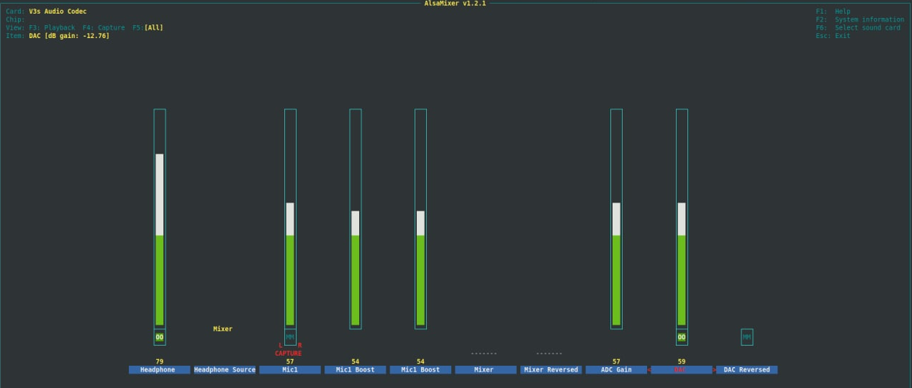

# meta-chai

yocto layer for lichee-pi zero (Allwinner V3s) based on mainline u-boot 2021.xx and kernel 5.x

for easy start
```bash
repo init -u git@github.com:DAMEK86/lichee-manifests.git
repo sync
```

## How to use

For instance if you like to build variant `licheepizero-dock`, you can start with the following bash script:

```bash
export TEMPLATECONF=$PWD/sources/meta-nightowl/conf/variant/licheepizero-dock
source sources/poky/oe-init-build-env build

bitbake chai-image
```

## how to use zero-dock mic

First of all, the v3s audio coded has no MIC1 bias. Instead, it looks to me like an differential input. I was able to get the mic working by changing the MIC setting from single ended to Left/Right within `alsamixer`.



For easy verification, use the _chai-image-audio_ with the alsa-tools. Just plugin your headphone, setup ALSA like the picture above and run `alsaloop` and verify the microphone 😎️

## enable/disable kernel features

depending on the enabled machine features, kernel features are added.
- alsa - sound and codec are baked in
- screen - FB are backed in
- touchscreen - PWM and Touchscreen for NS2009 (onboard) is backed in

you can add machine features by edit `conf/local.conf`
just use `MACHINE_FEATURES_append` or `MACHINE_FEATURES_remove`

## UI images

there are 2 images

```bash
chai-image-ui
qt5-image
```

The chai-image-ui starts htop as a example.
The qt5 image instead contains an calculator example. For best user-experience, enable touchscreen support.
To start the calculator, execute `/opt/qt-simple-calc/simpleCalculator`.

To start bad_apple on **chai-image-ui**, execute `gst-play-1.0 --videosink=fbdevsink /usr/share/bad_apple_30.mp4` 

The backed in splash screen appears on first reboot or second start.

## shutdown / reboot

The Zero and Zero-Dock uses an __EA3036__ PMIC with routed __enable__ pins to 5V. As a result, the power consumption will not drop to _zero_ on a `shutdown`. A possible workaround could be using a pin to drive a _self-holding circuit_.
`reboot` instead works as expected.

## u-boot / network boot

### tftp

on startup you can download kernel and corresponding device-tree over tftp

```bash
setenv ipaddr <licheeip>
tftp 0x42000000 <serverip>:zImage; tftp 0x43000000 <serverip>:sun8i-v3s-licheepi-zero-dock.dtb; bootz 0x42000000 - 0x43000000"
```

HINT: u-boot reads unique mac from chip

as a starting point, you can use this simple script to host a local tftp server in docker

```bash
docker run --rm -it -p 69:69/udp \
    -v ${PWD}/zImage:/tftpboot/zImage:ro \
    -v ${PWD}/sun8i-v3s-licheepi-zero-dock.dtb:/tftpboot/sun8i-v3s-licheepi-zero-dock.dtb:ro \
    darkautism/k8s-tftp
```

this image is based on a tiny golang implementation and works very well for my purposes, see https://github.com/darkautism/k8s-tftp

### network boot / nfsroot

to enable network boot, you need to enable kernel features by adding `KERNEL_ENABLE_NFS = "1"` to your ____local.conf__.
after this, your kernel shall be able to mount a nfs as rootfs

use the kernel cmdline to tell the kernel we want to use a network rootfs. I used the following script in u-boot cmd for my testing:

```bash
setenv bootargs "console=ttyS0,115200 root=/dev/nfs ip=192.168.5.78:192.168.5.80:192.168.5.80:255.255.255.0:licheepizero-dock:eth0 nfsroot=192.168.5.80:/export,tcp,v3 rootwait panic=2 debug"
setenv origbootcmd "$bootcmd"
setenv ipaddr 192.168.5.78
setenv bootcmd "tftp 0x42000000 192.168.5.80:zImage; tftp 0x43000000 192.168.5.80:sun8i-v3s-licheepi-zero-dock.dtb; bootz 0x42000000 - 0x43000000"
run bootcmd
```

for a detailed description of nfsroot parameters see https://www.kernel.org/doc/Documentation/filesystems/nfs/nfsroot.txt

as a starting point, you can use *nfs-kernel-server*

as a reference have a look into https://community.arm.com/developer/tools-software/oss-platforms/w/docs/542/nfs-remote-network-userspace-using-u-boot or
http://linux-sunxi.org/How_to_boot_the_A10_or_A20_over_the_network#TFTP_booting

## sunxi-tools / flash boot

sunxi-tools from github can be used for u-boot / kernel developing and nor-flash programming
__HINT:__ official prebuilt packages for ubuntu/debian seems to not working on ubuntu 20.x
### how to build sunxi-tools

```bash
sudo apt install libfdt-dev libusb-1.0-0-dev
git clone git@github.com:linux-sunxi/sunxi-tools.git
cd sunxi-tools
make
```

### fel boot

```bash
sudo sunxi-tools/sunxi-fel -v uboot u-boot-sunxi-with-spl.bin \
    write 0x42000000 zImage \
    write 0x43000000 sun8i-v3s-licheepi-zero-dock.dtb \
    write 0x43100000 boot.scr
```

### program flash and boot from fel / flash

write kernel, dtb to flash and start uboot from fel cli
```bash
sudo ./sunxi-tools/sunxi-fel \
    spiflash-write 0x0e0000 sun8i-v3s-licheepi-zero-dock-licheepizero-dock.dtb \
    spiflash-write 0x100000 zImage-licheepizero-dock.bin
sudo ./sunxi-tools/sunxi-fel uboot u-boot-sunxi-with-spl.bin
```
for booting from flash
```bash
sudo ./sunxi-tools/sunxi-fel spiflash-write 0x0 u-boot-sunxi-with-spl.bin
```
